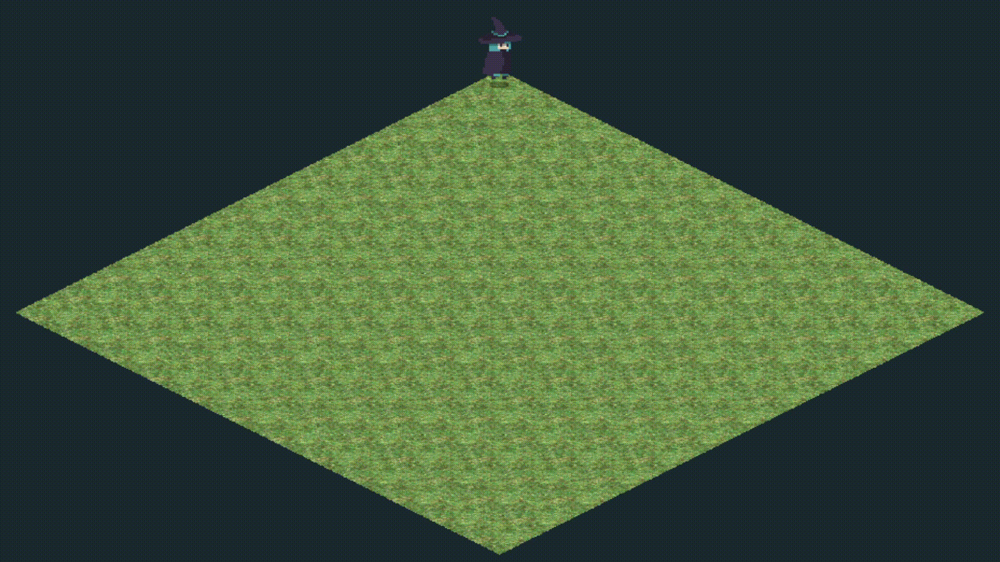

# Atividade Vivencial 3 - Desenho e Navegação em Tilemap Isométrico

## Autores

* Júlia Faccio Zanette
* Samuel de Oliveira Pasquali

## Resumo da Atividade

O objetivo desta atividade é explorar a representação de cenários 2D utilizando **tilemap**, **indexação de tiles** e uma estratégia de visualização **isométrica em formato de diamante**.

A solução implementa uma cena interativa em OpenGL com um mapa 12x12, renderizado a partir de um tileset isométrico. A personagem Blue Witch pode ser movimentada pelo jogador e, a cada deslocamento, pinta a célula visitada com o tile atualmente selecionado.

### Funcionalidades Implementadas

1. **Mapa Isométrico em Tilemap**

   * O cenário possui dimensão 12x12.
   * Cada posição da matriz armazena um índice de tile.
   * Os índices selecionam regiões específicas do tileset `Floor_Grass_01-128x64.png`.

2. **Estratégia de Visualização em Diamante**

   * A classe `TileMap` armazena a matriz de índices do cenário.
   * A interface `TilemapView` define a conversão entre coordenadas do mapa e coordenadas da tela.
   * A classe `DiamondView` implementa a projeção isométrica em formato de diamante.

3. **Personagem Animado**

   * A personagem principal é a Blue Witch.
   * A personagem se desloca por células do mapa.

4. **Pintura Interativa de Tiles**

   * O jogador pode selecionar tiles usando as teclas numéricas de 0 a 7.
   * Ao mover a personagem, a célula de destino recebe o tile selecionado.
   * O título da janela exibe a posição atual, o tile da célula e o tile selecionado para pintura.

## Como Executar

### Compilação

1. **Pré-requisitos:**
	- Ter GLFW, GLAD e GLM configurados no ambiente de desenvolvimento.
	- Compilar o projeto com CMake.

2. **Compilação e execução:**
   No terminal, dentro da pasta do projeto, execute:
   ```
   cd build
   cmake --build .
   ```
   Após a compilação, execute o programa com:
   ```
   ./AtividadeVivencial3.exe
   ```

## Estrutura de Recursos

O projeto utiliza os seguintes conjuntos de imagens:

### Tileset do Cenário

```
assets/
└── tex/
    └── SBS - Isometric Floor Tiles - Small 128x64/
        └── Small 128x64/
            └── Exterior/
                └── Grass/
                    └── Floor_Grass_01-128x64.png
```

### Personagem

```
assets/
└── sprites/
    └── Blue Witch/
        └── Blue_witch/
            └── B_witch_run.png
```

## Organização dos Arquivos

* `AtividadeVivencial3.cpp`: fluxo principal da aplicação, entrada do teclado, pintura, atualização e renderização
* `TileMap.h`: matriz indexada do tilemap
* `TilemapView.h`: interface para estratégias de visualização do mapa
* `DiamondView.h`: projeção isométrica em diamante
* `GameTypes.h`: estruturas de textura, spritesheet, vetor e personagem
* `gl_utils.h/.cpp`: carregamento de texturas, spritesheets e shaders
* `stb_image.cpp`: integração da biblioteca `stb_image`
* `_geral_vs.glsl`: vertex shader gerals
* `_geral_fs.glsl`: fragment shader geral

## Controles

* Teclas 0 a 7: selecionar o tile usado na pintura
* Seta Superior ou W: mover para cima
* Seta Inferior ou S: mover para baixo
* Seta Esquerda ou A: mover para a esquerda
* Seta Direita ou D: mover para a direita* 
* Q/E/C/Z: mover uma célula na diagonal
* ESC: encerrar a aplicação

## Resultado Esperado

Ao executar a aplicação:

* Uma janela de 1000x800 pixels será aberta.
* O mapa isométrico 12x12 será exibido em formato de diamante.
* A Blue Witch iniciará na célula 0,0.
* O jogador poderá mover a personagem usando setas, WASD e diagonais com Q/E/C/Z.
* O jogador poderá selecionar tiles de 0 a 7 para pintar o mapa.
* Cada célula visitada será atualizada com o tile selecionado.
* O título da janela exibirá a posição atual, o tile da célula e o tile selecionado.

