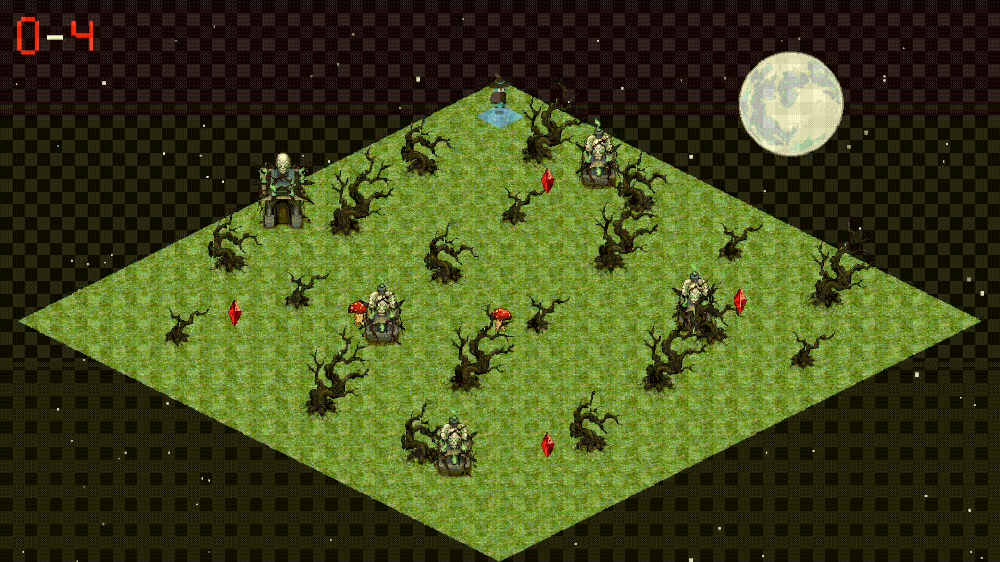

# Grau B - Jogo com Tilemap Isometrico Configuravel

## Visao Geral

O `GrauB` e a consolidacao dos conceitos trabalhados ao longo das atividades anteriores, principalmente:

- `M5`: personagem animado, troca de estados visuais e uso de spritesheets
- `M6`: tilemap isometrico, indexacao de tiles e projecao em formato diamond
- `AtividadeVivencial3`: movimentacao da personagem no mapa isometrico e interacao com obstaculos e inimigos

O objetivo desta entrega foi transformar esses elementos em um prototipo de jogo mais completo, com regras de vitoria e derrota, configuracao externa por arquivo texto e separacao clara entre:

- dados da fase
- logica de movimentacao
- logica de colisao
- renderizacao do mapa
- renderizacao de sprites e interface

Em vez de deixar a fase fixa dentro do codigo, o projeto passou a carregar um `map.txt`, que define:

- dimensoes do mapa
- tiles usados no chao
- tiles caminhaveis e nao caminhaveis
- posicao inicial da personagem
- posicao de arvores
- posicao de cristais
- trajetos dos inimigos

Isso aproxima a atividade de uma estrutura mais real de jogo, onde o codigo implementa as regras e o arquivo de configuracao descreve a fase.

## Objetivo da Atividade

O enunciado do Grau B pedia um prototipo de jogo simples com tilemap isometrico, incluindo:

1. mapa com no minimo `15x15`
2. configuracao da fase por arquivo
3. personagem animado
4. movimentacao em `8 direcoes`
5. restricao a tiles caminhaveis
6. coleta de itens
7. evitacao de perigos
8. troca de tile ao pisar
9. objetivo de vitoria
10. logica de objetos no arquivo texto
11. logica de caminhabilidade no arquivo texto

Esta implementacao atende esses pontos da seguinte forma:

- o mapa atual possui `20x20` tiles
- a fase e carregada a partir de `map.txt`
- a personagem principal e a `Blue Witch`, com animacao de corrida e morte
- o movimento ocorre em `N`, `S`, `L`, `O`, `NE`, `NO`, `SE`, `SO`
- a matriz `WALKABLE` define por onde a bruxa pode andar
- os cristais sao os itens de coleta
- os `Mushrooms` funcionam como ameacas moveis
- os tiles pisados trocam para o tileset de visitados
- a vitoria ocorre ao coletar todos os cristais configurados
- arvores, cristais, inimigos e posicao inicial sao definidos no arquivo

## Resumo do Jogo

O jogador controla uma bruxa em um mapa isometrico. O objetivo e coletar todos os cristais da fase sem colidir com os inimigos. Durante a partida:

- a bruxa anda apenas de tile em tile
- o movimento so acontece em tiles permitidos
- arvores tambem bloqueiam a passagem
- os inimigos percorrem trajetos lineares
- a colisao com um inimigo causa derrota
- cada tile visitado muda de aparencia

Com isso, o projeto deixa de ser apenas uma demonstracao grafica e passa a ter um ciclo jogavel completo:

- iniciar
- explorar
- evitar perigo
- coletar objetivo
- vencer ou perder
- reiniciar

## Principais Funcionalidades

### 1. Tilemap isometrico

- o mapa usa projecao `diamond`
- cada posicao do grid possui um indice de tile
- os tiles sao desenhados em ordem diagonal para preservar a profundidade visual
- a conversao de coordenadas do mapa para a tela e feita pela `DiamondView`

### 2. Fase configuravel por arquivo

O arquivo `map.txt` concentra os dados da fase. Isso permite alterar o comportamento do jogo sem mexer diretamente na logica principal.

Ele define:

- `TILESET`: imagem base do piso, quantidade de colunas e linhas e tamanho do tile
- `VISITED_TILESET`: imagem usada quando o jogador pisa em um tile
- `SIZE`: dimensoes do mapa
- `MAP`: matriz de indices do chao
- `WALKABLE`: matriz de permissao de movimento
- `WITCH`: posicao inicial da personagem
- `TREES`: obstaculos estaticos
- `CRYSTALS`: itens coletaveis
- `MUSHROOMS`: inimigos moveis com ponto inicial, final e velocidade

### 3. Personagem animado

A personagem principal usa spritesheet animada:

- animacao de corrida durante a movimentacao
- animacao de morte ao colidir com inimigo
- orientacao horizontal ajustada conforme a direcao

### 4. Movimento em 8 direcoes

O movimento e discreto, sempre entre centros de tiles, como pedido no enunciado.

Direcoes permitidas:

- norte
- sul
- leste
- oeste
- nordeste
- noroeste
- sudeste
- sudoeste

### 5. Caminhabilidade e bloqueios

O jogo nao permite que a personagem atravesse:

- tiles marcados como `0` em `WALKABLE`
- tiles ocupados por arvores

Essa verificacao acontece antes de cada movimento.

### 6. Coleta, risco e objetivo

- os cristais sao coletados por contato
- os inimigos `Mushrooms` precisam ser evitados
- ao encostar em um inimigo, a bruxa morre
- ao coletar todos os cristais necessarios, o jogador vence

### 7. Troca visual dos tiles visitados

Quando a bruxa entra em um tile valido:

- o tile e marcado como visitado
- o mapa troca a aparencia daquele chao para indicar exploracao

Isso cumpre a exigencia de troca de tile ao pisar.

## Estrutura do Arquivo `map.txt`

O formato foi organizado em blocos legiveis. Um resumo da estrutura atual:

```txt
TILESET "caminho/tileset.png" 3 6 74.88 37.44
VISITED_TILESET "caminho/visitado.png" 3 6 1
SIZE 20 20

MAP
...

WALKABLE
...

WITCH 1 1

TREES 25
...

CRYSTALS 4
...

MUSHROOMS 2
...
```

### Significado de cada bloco

- `TILESET`: informa de onde vem o piso principal
- `VISITED_TILESET`: informa de onde vem o tile de piso visitado
- `SIZE`: define `colunas` e `linhas`
- `MAP`: matriz com os indices dos tiles do chao
- `WALKABLE`: matriz binaria, onde `1` permite andar e `0` bloqueia
- `WITCH`: coluna e linha iniciais da personagem
- `TREES`: lista de arvores, com `col row type`
- `CRYSTALS`: lista de cristais, com `col row`
- `MUSHROOMS`: lista de inimigos, com inicio, fim, velocidade e estado inicial de movimento

### Observacoes importantes

- o mapa precisa ter pelo menos `15x15`
- os cristais precisam nascer em tiles validos
- arvores tambem tornam o tile nao caminhavel
- o tamanho visual do tile tambem e lido do arquivo

## Controles

- `W` ou `Seta para cima`: norte
- `S` ou `Seta para baixo`: sul
- `A` ou `Seta para esquerda`: oeste
- `D` ou `Seta para direita`: leste
- `Q`: noroeste
- `E`: nordeste
- `Z`: sudoeste
- `C`: sudeste
- `R`: reinicia apos vitoria ou derrota
- `ESC`: fecha a aplicacao

## Como Executar

### Pre-requisitos

- projeto compilando com `CMake`
- dependencias graficas resolvidas pelo projeto
- ambiente capaz de executar `OpenGL`, `GLFW` e `GLAD`

### Compilacao

Na raiz do projeto:

```powershell
cmake -S . -B build
cmake --build build --target GrauB
```

### Execucao

```powershell
.\build\GrauB.exe
```

## Organizacao dos Arquivos do Grau B

- `GrauB.cpp`: fluxo principal do jogo, leitura da fase, atualizacao, colisao e renderizacao
- `TileMap.h`: estrutura que armazena os indices do mapa
- `TilemapView.h`: interface de conversao mapa para tela
- `DiamondView.h`: implementacao da projecao isometrica diamond
- `GameTypes.h`: structs de textura, spritesheet, ator, cristal, inimigo e estados do jogo
- `gl_utils.h` e `gl_utils.cpp`: utilitarios de OpenGL, texturas, shaders e spritesheets
- `map.txt`: definicao completa da fase
- `_geral_vs.glsl`: vertex shader usado na renderizacao
- `_geral_fs.glsl`: fragment shader usado na renderizacao
- `win.png`: imagem de vitoria
- `game-over.png`: imagem de derrota
- `restart-exit.png`: instrucoes visuais da tela final

## Fluxo Geral do Programa

De forma resumida, o programa funciona assim:

1. carrega a configuracao da fase pelo `map.txt`
2. valida dimensoes, tiles e objetos da fase
3. inicializa a janela e o contexto OpenGL
4. carrega texturas, spritesheets e shaders
5. cria o estado inicial da partida
6. entra no loop principal
7. processa entrada do teclado
8. atualiza animacoes e inimigos
9. resolve coleta e colisao
10. desenha mapa, objetos, personagem e interface
11. mostra tela de vitoria ou derrota quando necessario

## Decisoes de Implementacao

### Uso de configuracao externa

A principal decisao deste trabalho foi deslocar a fase para fora do codigo. Isso traz algumas vantagens:

- facilita testar variacoes de fase
- organiza melhor a logica do jogo
- deixa o codigo menos dependente de valores fixos
- atende diretamente ao enunciado

### Ordem de renderizacao do mapa

O mapa e desenhado em ordem diagonal. Isso evita problemas de profundidade visual comuns em mapas isometricos e ajuda a manter a leitura correta dos tiles.

### Arvores em duas passadas

As arvores sao desenhadas em duas partes para reforcar o efeito de profundidade:

- uma parte fica atras do personagem
- outra parte pode aparecer na frente

Isso melhora a percepcao espacial do cenario.

### Estado de tiles visitados

Em vez de apenas mover a personagem, o jogo guarda quais tiles ja foram percorridos. Isso:

- evidencia a exploracao
- cumpre o requisito de troca de tile
- melhora o feedback visual para o jogador

## Relacao com os Trabalhos Anteriores

### Heranca de `M5`

Do `M5`, o projeto reaproveita a ideia de:

- personagem como sprite animado
- controle por estados visuais
- uso organizado de spritesheets

### Heranca de `M6`

Do `M6`, o projeto amplia:

- tilemap indexado
- projecao isometrica
- desenho por tiles
- inimigos e coleta em mapa isometrico

### Heranca da `AtividadeVivencial3`

Da `AtividadeVivencial3`, o projeto evolui:

- movimentacao em mapa isometrico
- controle em multiplas direcoes
- estrutura geral de jogo no grid

## Resultado Esperado

Ao executar o programa, espera-se que:

- a janela abra com um cenario isometrico completo
- a bruxa apareca na posicao configurada
- o mapa seja desenhado conforme o `map.txt`
- os tiles bloqueados realmente impecam a passagem
- as arvores aparecam como obstaculos visuais e logicos
- os cristais possam ser coletados
- os inimigos se movimentem continuamente
- a colisao com inimigo produza derrota
- a coleta total dos cristais produza vitoria
- o jogador possa reiniciar com `R`




## Possiveis Extensoes Futuras

Algumas evolucoes naturais para este projeto seriam:

- multiplas fases com varios arquivos de configuracao
- mais tipos de tiles especiais
- pontos de chegada alem da coleta
- sistema de pontuacao
- barra de vida
- mais comportamentos de inimigos
- tela inicial e menu
