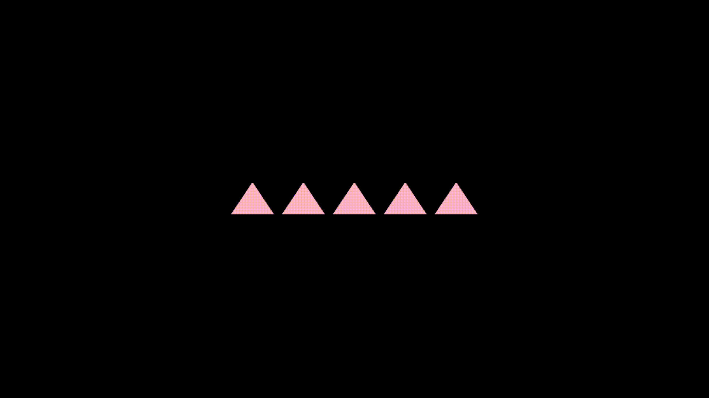

# Desafio M2

## Resumo da Atividade

O objetivo desta atividade é praticar a criação e renderização de triângulos com OpenGL em duas etapas:

1. Criar 5 triângulos fixos na tela usando uma função dedicada para gerar VAO/VBO.
2. Permitir a criação dinâmica de triângulos com clique do mouse, posicionando cada triângulo no ponto clicado e aplicando uma cor aleatória.

## Como Executar

1. **Pré-requisitos:**
	- Ter GLFW, GLAD e GLM configurados no ambiente de desenvolvimento.
	- Compilar o projeto com CMake.

2. **Compilação e execução:**
   No terminal, dentro da pasta do projeto, execute:
   ```
   cd build
   cmake --build .
   ```
   Após a compilação, execute o programa com:
   ```
   ./M2.exe
   ```

## Controles

- **Clique esquerdo do mouse:** cria um novo triângulo na posição clicada, com cor aleatória
- **ESC:** fecha a aplicação

## Resultado Esperado

- A janela abre com 5 triângulos fixos desenhados.
- A cada clique, um novo triângulo aparece na posição do clique.
- Cada novo triângulo recebe uma cor diferente.

